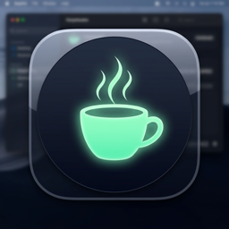
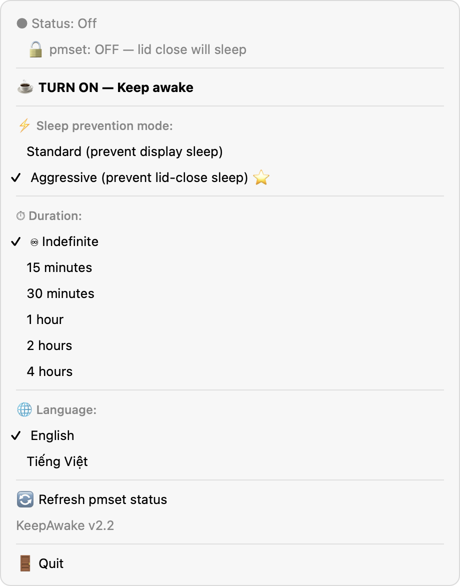
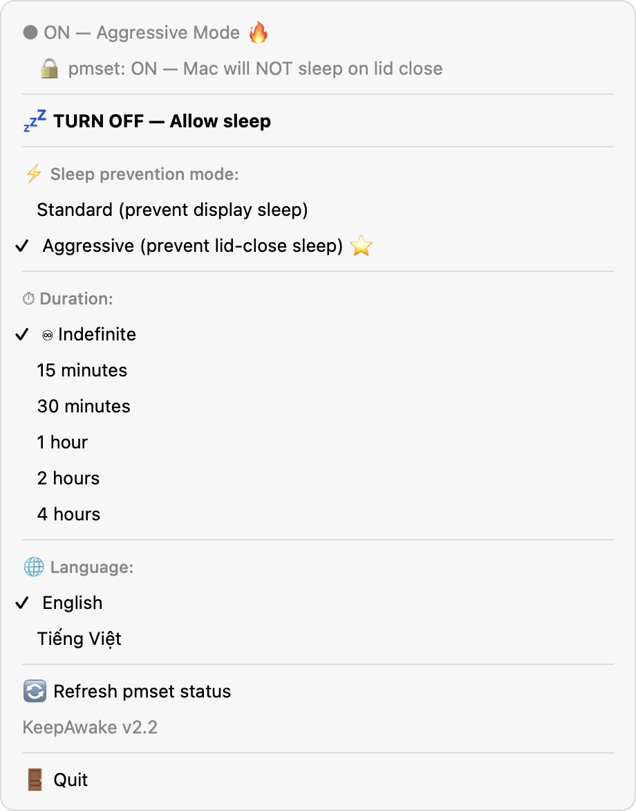
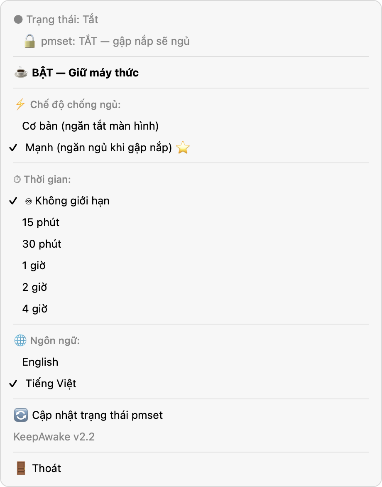
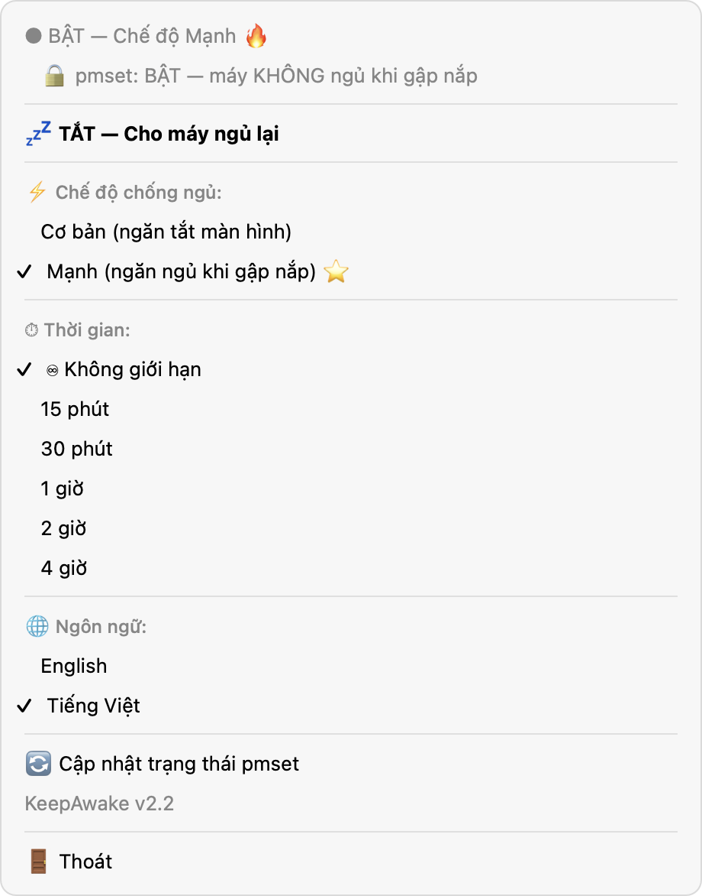
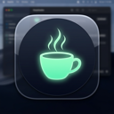
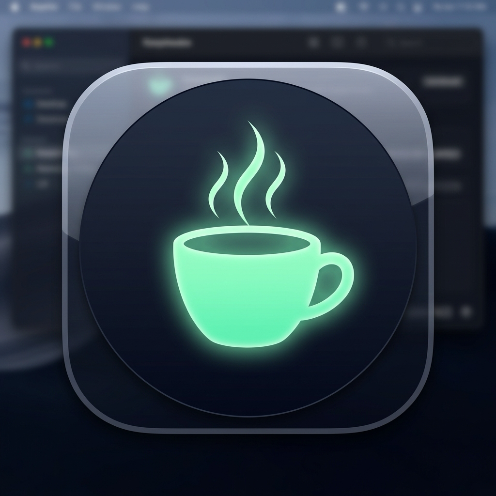

<p align="center">
  
</p>

<h1 align="center">KeepAwake</h1>

<p align="center">
A tiny macOS menu bar app that keeps your Mac awake — even when the lid is closed.<br>
<em>(Tiếng Việt bên dưới)</em>
</p>

<p align="center">
  
  
  
  
</p>

---

## Screenshots

<table>
  <tr>
    <th>English — Off</th>
    <th>English — On (Aggressive)</th>
  </tr>
  <tr>
    <td></td>
    <td></td>
  </tr>
  <tr>
    <th>Tiếng Việt — Tắt</th>
    <th>Tiếng Việt — Bật (Chế độ Mạnh)</th>
  </tr>
  <tr>
    <td></td>
    <td></td>
  </tr>
</table>

## Logo

<p>
  &nbsp;
  &nbsp;
  &nbsp;
  
</p>

---

## English

### What it does

KeepAwake prevents macOS from going to sleep so you can leave the lid closed while a game downloads, "listen" to a video plays, or a long task runs. It combines three layers of protection:

1. **`caffeinate`** subprocess with `-dimsu` flags — prevents display, idle, disk, and system sleep, and asserts user activity.
2. **IOKit power assertions** — 5 different assertion types covering both idle and active sleep prevention.
3. **`pmset -a disablesleep 1`** (Aggressive mode only) — the kernel-level flag that actually keeps the Mac awake when the lid closes. This requires admin password.

The app verifies the kernel state via `ioreg` after each pmset call so the menu indicator always reflects reality.

### Features

- **Two modes**: Standard (display + idle sleep) vs Aggressive (also blocks lid-close sleep).
- **Live pmset indicator**: 🔒 / 🔓 in the menu, read directly from IOKit.
- **Durations**: indefinite, 15 min, 30 min, 1 h, 2 h, 4 h.
- **Crash recovery**: detects orphaned `pmset disablesleep=1` from previous crashes and offers to restore it on next launch.
- **Bilingual UI**: English + Tiếng Việt, auto-detected from system locale, switchable from the menu.

### Install

Requires macOS 13+.

```bash
git clone https://github.com/rowiz-le/KeepAwake-macos.git
cd KeepAwake-macos
./build.sh
```

The script compiles `main.swift` into `KeepAwake.app` and offers to install it to `/Applications`.

### Usage

1. Click the coffee-cup icon in the menu bar.
2. Pick a mode: **Aggressive ⭐** is the default — it asks for your admin password the first time it's enabled.
3. Click **ON — Keep awake**.
4. Verify the menu shows `🔒 pmset: ON — Mac will NOT sleep on lid close`.
5. Close the lid.

### Caveats

- Aggressive mode prompts for admin password every time it's activated (macOS limitation — no signed helper bundled).
- On Apple Silicon, even with `pmset disablesleep=1`, prolonged lid-closed operation while on battery may still trigger thermal-related throttling or hibernate. Plugging in is strongly recommended.
- The app uses the deprecated `NSUserNotification` API for simplicity. Notifications still appear but with no user-configurable settings.

### License

MIT — see [LICENSE](LICENSE).

---

## Tiếng Việt

### App này làm gì

KeepAwake ngăn MacBook ngủ — kể cả khi bạn gập nắp — để bạn có thể yên tâm tải game, "nghe" nhạc youtube... hoặc chạy task dài. App dùng ba lớp bảo vệ:

1. **Subprocess `caffeinate`** với flag `-dimsu` — ngăn màn hình, idle, đĩa, và system sleep.
2. **IOKit power assertions** — 5 loại assertion khác nhau.
3. **`pmset -a disablesleep 1`** (chỉ chế độ Mạnh) — flag cấp kernel mới thực sự ngăn được sleep khi gập nắp. Cần password admin.

Sau mỗi lần gọi pmset, app verify lại bằng `ioreg` nên indicator trên menu luôn phản ánh trạng thái thực.

### Tính năng

- **Hai chế độ**: Cơ bản (chống tắt màn hình + idle sleep) và Mạnh (chống cả gập-nắp-ngủ).
- **Indicator pmset trực tiếp**: 🔒 / 🔓 trong menu, đọc thẳng từ IOKit.
- **Thời gian**: không giới hạn, 15 phút, 30 phút, 1 giờ, 2 giờ, 4 giờ.
- **Crash recovery**: phát hiện `pmset disablesleep=1` còn sót lại từ lần crash trước và hỏi user khôi phục ở lần mở sau.
- **Song ngữ**: Tiếng Việt + English, tự detect locale, switch được từ menu.

### Cài đặt

Yêu cầu macOS 13+.

```bash
git clone https://github.com/rowiz-le/KeepAwake-macos.git
cd KeepAwake-macos
./build.sh
```

Script sẽ compile `main.swift` thành `KeepAwake.app` và hỏi có muốn cài vào `/Applications` không.

### Cách dùng

1. Click vào icon cốc cà phê trên menu bar.
2. Chọn chế độ: **Mạnh ⭐** là mặc định — sẽ hỏi password admin lần đầu bật.
3. Click **BẬT — Giữ máy thức**.
4. Verify menu hiển thị `🔒 pmset: BẬT — máy KHÔNG ngủ khi gập nắp`.
5. Gập nắp.

### Lưu ý

- Chế độ Mạnh hỏi password admin mỗi lần bật (giới hạn của macOS — app không có helper đã ký).
- Trên Apple Silicon, dù `pmset disablesleep=1`, gập nắp lâu khi chạy pin vẫn có thể trigger thermal throttle hoặc hibernate. Khuyến nghị cắm sạc.
- App dùng API `NSUserNotification` đã deprecated cho gọn. Notification vẫn hiện được nhưng không có setting tinh chỉnh.

### Giấy phép

MIT — xem [LICENSE](LICENSE).
